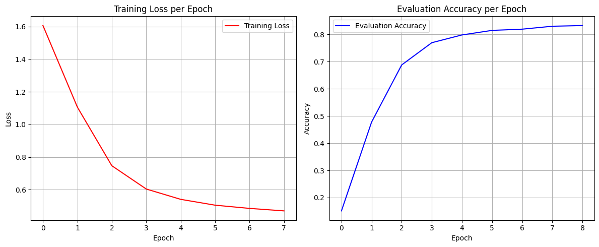
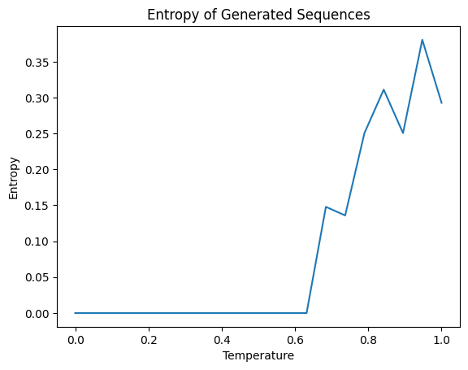
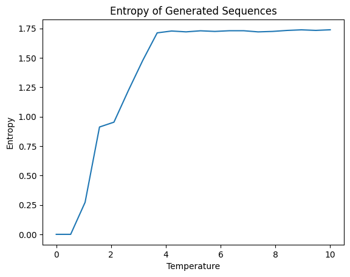
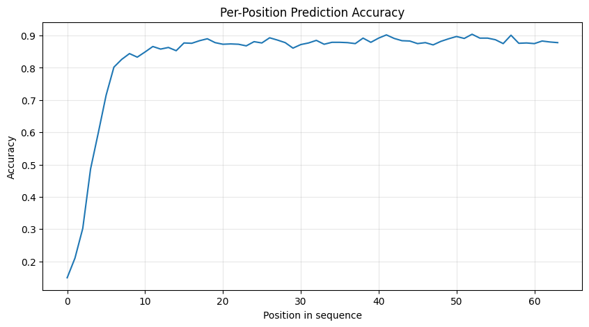

DNN 3: Transformer GPT-OSB-20B
===

[Notebook](https://colab.research.google.com/drive/1R685GZibQgbMbeb3-ieoIOaONSE4Ixpx?usp=sharing) (but Python file is a little cleaner as it doesn't include problem statements and debug outputs, and may be easier to navigate)

In this lab, we implement the GPT-OSS Transformer toy model and apply it to a toy example.

**Implementation**

The implementation follows instructions, with some clarifications:

* In RoPE, we can use different possible pairings: one is `0-1, 2-3, ...`, another is `0-n//2, 1-(n//2+1), 2-(n//2+2), ...`. The latter is however easier to implement and is the one that matches the seeded test results.

* An efficient RoPE implementation requires pre-computing the trigonometric values - as they are used multiple times, this can lead to 2-3x speed of the pass.

* RoPE use is hidden inside the GroupedQueryAttention and SWAttention classes, and is not declared explicitly in the Transformer block. RoPE is applied before the key weights in order to fully enable its benefits.

* When `num_kv_heads` is unspecified, we assume it to match `num_heads`.

* MoE is optimized by calling a forward pass through the router once, then iterating over experts and applying a mask to filter the outputs relevant to the specific expert during calculation; this avoids a double or triple loop we would have needed if we also iterated over batches.

* There is some code reduplication; it is unfortunately unavoidable without going out of scope for the TODOs.

**Model training and evaluation**

We used the pre-defined number of epochs and learning rate. 

We are dealing with a toy example of a vocabulary consisting on only 7 words - therefore, we can apply cross-entropy directly. We do it by flattening both the model output logits and target token indices to 2D tensors before computing the loss across all tokens in each batch. Under these conditions, the model reaches 82% accuracy.

**Token generation**

Token generation is done by feeding the complete sequence of previously generated tokens back into the model at each step and selecting the next token from the output distribution. In other words, we call the model repeatedly, and each time we provide all the previous tokens.

When using greedy decoding (always selecting the most probable token via argmax), the output is consistently degenerate - the model loops on the same token indefinitely. This is because of a feedback loop where, while the initial context is still too short for a reliable prediction, each predicted token becomes part of the context and reinforces predicting the same token again.

In order to avoid that, we introduce nucleus sampling.

We follow the standard algorithm, ensuring that the last token that makes the cumulative probability exceed `top_p` parameter is still included. 

**Temperature**

The nucleus sampling algorithm depends on temperature. We would like to measure the influence of the temperature numerically. For that, we go over a range of possible temperatures and estimate the average entropy of the sequence for each temperature value. To minimise noise, we do 100 generations per each temperature.

The results are the following:

This shows that the nucleus sampling resolved the looping problem effectively, allowing it to generate sequences that avoid the initial feedback loop. We see that we need `t=0.7` or higher in order to escape the looping behavior. At `t=1`, we essentially choose the next token from the raw model logits without clipping it.

We can try raising the temperature even higher:

An entropy of `~1.95 = log(7)` indicates that the model behaviour at that point is essentially random, so at `t >= 4` the model behaviour degrades to a randomized choice across the vocabulary.

**Per-token accuracy**

The per-position accuracy is the following:

We see that the model has too little context to work with - it needs at least 8-10 tokens in order to achieve the baseline accuracy. The accuracy on longer text is actually higher than the overall accuracy rate would indicate, easily reaching 85-90%.

Overall, the result suggest a viable, if a small-scale architecture that shows promising results if scaled according to the vocabulary it operates with.